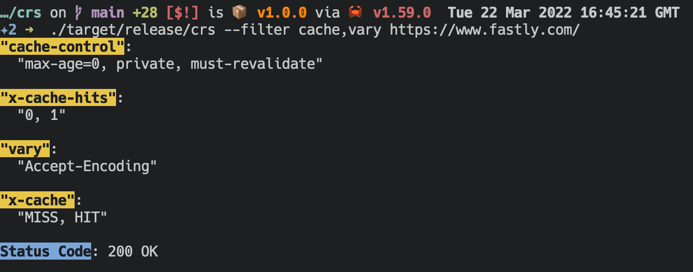
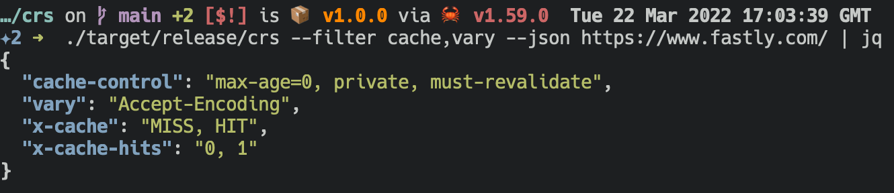

# crs

The `crs` command is a Rust version of the [Carbon](https://github.com/Integralist/carbon) CLI.

Carbon can make a HTTP request, then sort, filter and display the HTTP response headers. 

> **NOTE**: The name comes from carbon filtering: method of filtering impurities.

## Usage

```bash
$ crs --help
crs 1.0.0
A tool that issues HTTP requests, then parses, sorts and displays relevant HTTP response headers.

USAGE:
    crs [OPTIONS] <URL>

ARGS:
    <URL>    URL to request

OPTIONS:
    -c, --color <COLOR>      Output formatting can be modified based on TTY [default: auto]
                             [possible values: always, auto, never]
    -f, --filter <FILTER>    Comma-separated list of headers to display
    -h, --help               Print help information
    -j, --json               Output is formatted into JSON
    -V, --version            Print version information
```

## Examples

### Filtering



### JSON


