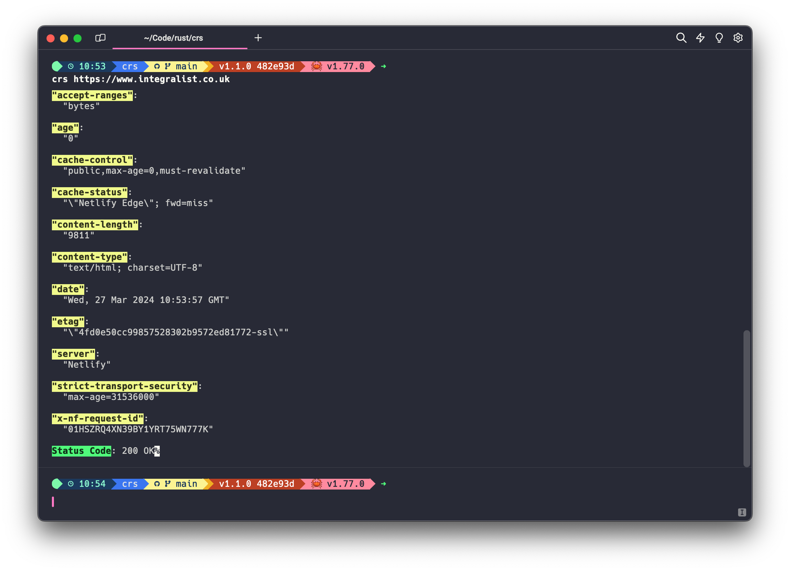
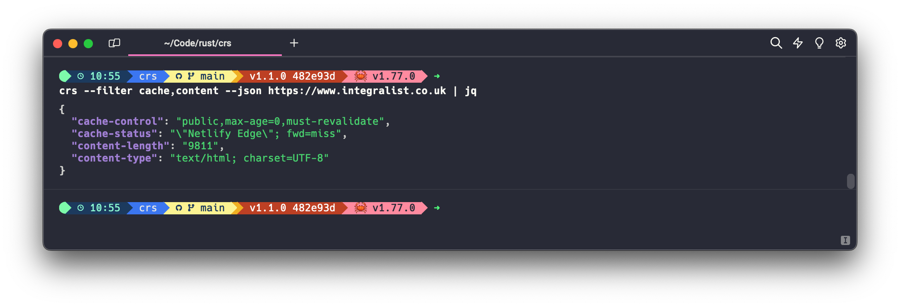
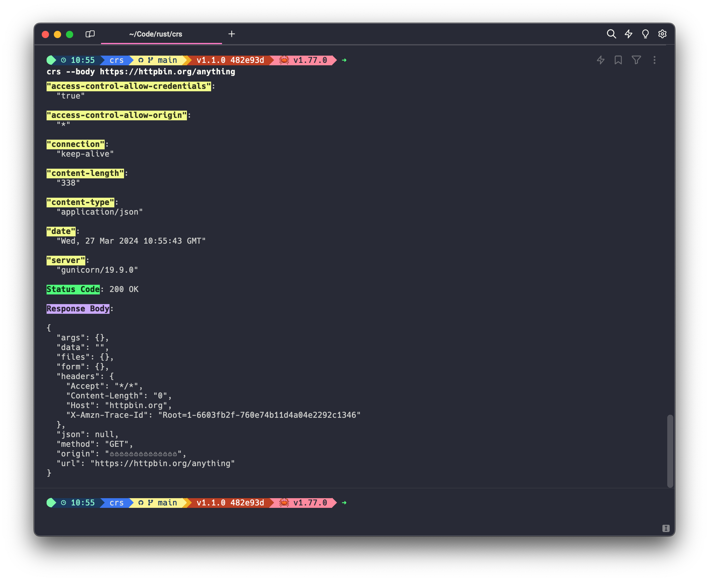

# crs

The `crs` command is a Rust version of the [Carbon](https://github.com/Integralist/carbon) CLI.

Carbon can make a HTTP request, then sort, filter and display the HTTP response headers.

> **NOTE**: The name comes from carbon filtering: method of filtering impurities.

## Usage

## Examples

### Default

The default behaviour is to display all response headers, followed by the HTTP status code:

### Filtering and JSON

- The `--filter` flag will attempt a partial match for each comma-separated value.
- The `--json` flag outputs the data as JSON.

> **NOTE**: The following example pipes to [`jq`](https://stedolan.github.io/jq/) for pretty-printing.

### Response Body

- The `--body` flag will display the response body below the HTTP headers/status.

> **NOTE:** The `--body` flag is incompatible with the `--json` flag\
> i.e. don't use `--json` and also try to include the response body.

